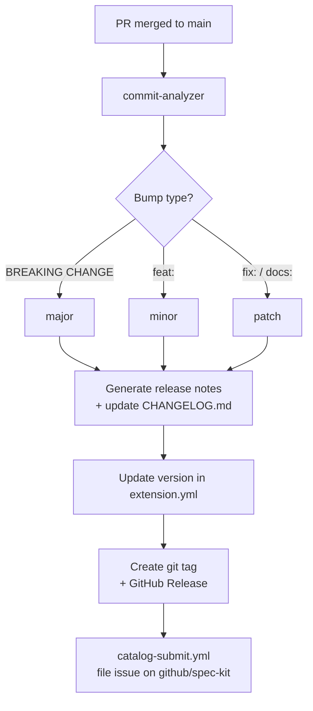

# Contributing to spec-kit-squad

## Getting Started

1. Fork the repository
2. Clone your fork: `git clone https://github.com/YOUR_USERNAME/spec-kit-squad.git`
3. Create a feature branch: `git checkout -b feat/my-change`

## Development

Install spec-kit and test the extension locally:

```bash
# In a spec-kit project
specify extension add squad --dev /path/to/spec-kit-squad

# Verify it's installed
specify extension list

# Test a command (in Claude Code)
# /speckit.squad.status
```

## Commit Convention

This repository uses [Conventional Commits](https://www.conventionalcommits.org/)
for automated versioning. The CI action reads commit messages to determine the
next semantic version:

| Prefix | Version bump | Example |
| --- | --- | --- |
| `feat:` | minor | `feat: add domain filtering to generate` |
| `fix:` | patch | `fix: handle missing tasks.md gracefully` |
| `docs:` | patch | `docs: improve route command examples` |
| `BREAKING CHANGE:` (footer) | major | Any commit with this in the footer |

## File Structure

```
spec-kit-squad/
├── extension.yml                  # Extension manifest — source of truth
├── squad-config.template.yml      # Config template installed with the extension
├── commands/
│   ├── init.md                    # /speckit.squad.init
│   ├── generate.md                # /speckit.squad.generate
│   ├── route.md                   # /speckit.squad.route
│   └── status.md                  # /speckit.squad.status
├── docs/                          # Developer docs (not installed with extension)
│   ├── README.md                  # Developer architecture reference
│   ├── CONTRIBUTING.md            # ← this file
│   └── CHANGELOG.md               # Version history
├── .github/
│   ├── scripts/
│   │   └── build-catalog-submission.py  # Jinja2 renderer: extension.yml → issue body
│   ├── templates/
│   │   └── catalog-submission.md.j2     # Jinja2 template for spec-kit catalog issue
│   └── workflows/                 # CI (not installed with extension)
├── README.md                      # User-facing docs
└── LICENSE
```

## Submitting Changes

1. Ensure `extension.yml` is valid YAML:
   ```bash
   yq eval '.' extension.yml
   ```
2. Verify all command files listed in `extension.yml` exist:
   ```bash
   grep 'file:' extension.yml | awk '{print $2}' | xargs -I{} test -f {} && echo "OK"
   ```
3. Commit with a conventional commit message
4. Open a Pull Request against `main`

## Release Process

Releases are fully automated via `semantic-release`. When a PR is merged to
`main`, the CI action automatically:



1. Analyzes commit messages to determine the next version
2. Generates release notes from conventional commits
3. Writes/updates `docs/CHANGELOG.md`
4. Updates `version:` in `extension.yml`
5. Commits those files back with `[skip ci]`
6. Creates a git tag and GitHub Release

> **Requires two secrets:**
>
> - `GH_TOKEN` — fine-grained PAT with contents/metadata read+write access
>   (used by semantic-release to push back the changelog and tag commits)
> - `PUBLIC_REPO_TOKEN` — classic PAT with `public_repo` scope (used by
>   `catalog-submit.yml` to open issues on `github/spec-kit`)
